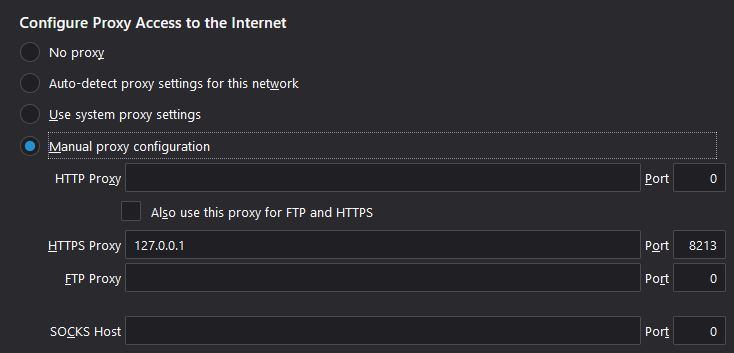

An attempt to choose the fastest of available IP addresses (DNS A records)

It will start a HTTPS proxy server on TCP 8213 port.

For every unique DOMAIN request it attempts to find some of the IP addresses associated to the domain and tunnels the connection to the fastest IP determined by it.  

